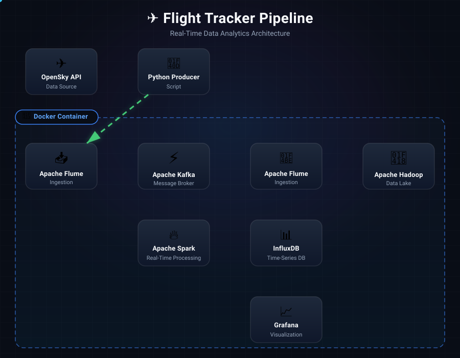
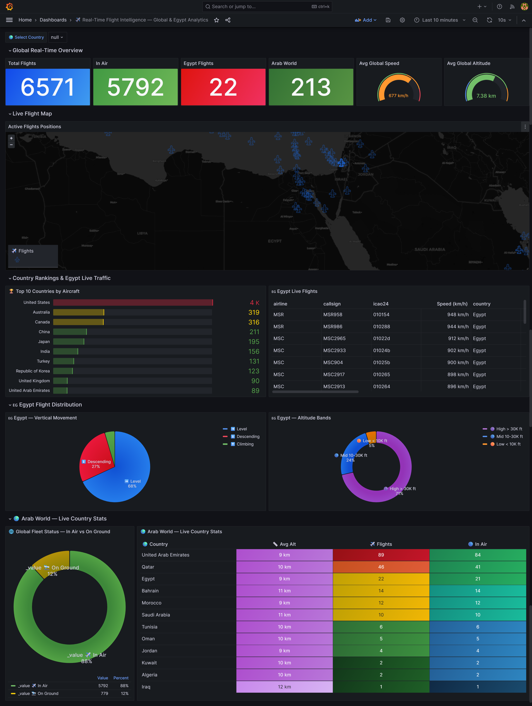
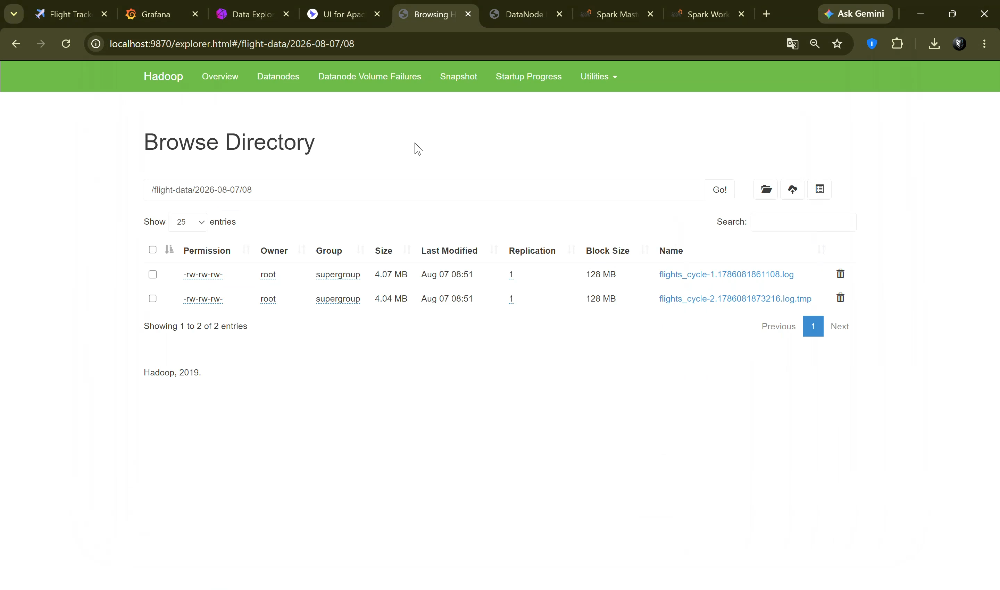
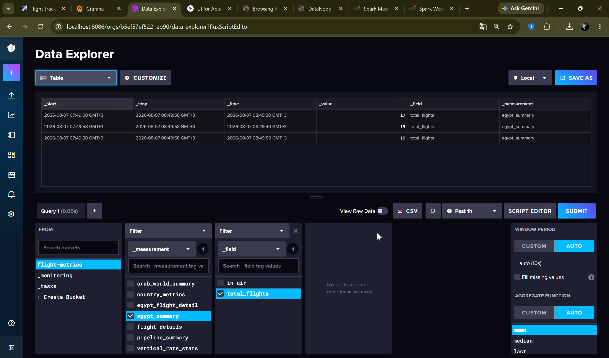

<div align="center">


<br/>

[](https://www.python.org/)
[](https://kafka.apache.org/)
[](https://spark.apache.org/)
[](https://hadoop.apache.org/)
[](https://www.docker.com/)
[](https://www.influxdata.com/)
[](https://grafana.com/)
[](https://flume.apache.org/)
[](https://nti.sci.eg/)

</div>

<br/>

<p align="center">
  
</p>

---

## 📌 Table of Contents

| # | Section | # | Section |
|:-:|:--------|:-:|:--------|
| 1 | [🎯 Overview](#-overview) | 6 | [🌐 Service URLs](#-service-urls) |
| 2 | [🏗️ Architecture](#️-architecture) | 7 | [🔧 Toolkit CLI](#-toolkit-cli) |
| 3 | [🎬 Demo](#-demo) | 8 | [🧠 Skills Acquired](#-skills-acquired) |
| 4 | [🧰 Tech Stack](#-tech-stack) | 9 | [📁 Project Structure](#-project-structure) |
| 5 | [🚀 Quick Start](#-quick-start) | 10 | [👤 Author](#-author) |

---

## 🎯 Overview

**An enterprise-grade, end-to-end real-time Big Data pipeline** that ingests live worldwide aircraft telemetry every 15 seconds, processes stream analytics at scale via Spark Structured Streaming, archives raw flight logs in a distributed Hadoop data lake, and visualizes live metrics on auto-provisioned Grafana dashboards — all fully containerized with Docker Compose across **11 services**.

> 🎓 Built as the **capstone project** for the **NTI Big Data Engineering Track**.

<br/>

| Pillar | Technology | What it does |
|:-------|:-----------|:-------------|
| ✈️ **Live Ingestion** | OpenSky API → Flume → Kafka | Pulls global aircraft state vectors every 15 seconds and distributes them across the pipeline |
| ⚡ **Stream Processing** | Spark Structured Streaming | Consumes Kafka topics, computes real-time flight metrics in micro-batches |
| 🐘 **Data Lake** | Hadoop HDFS | Immutably archives raw JSON flight events partitioned by date and hour |
| 📊 **Visualization** | InfluxDB + Grafana | Stores processed time-series metrics and renders live interactive dashboards |

---

## 🏗️ Architecture

<div align="center">



[🌐 **Open Interactive Architecture Diagram**](https://htmlpreview.github.io/?https://github.com/alimersal/Big-Data-Engineering-NTI-Projects/blob/master/flight_tracker-pipeline/flight-tracker-architecture.html)

</div>

## 🎬 Demo

<div align="center">

[](https://drive.google.com/file/d/13Uo43X0UD8ge7SLnBYNRikhD3W4cV9uy/view?usp=sharing)

</div>

<br/>

### 📊 Grafana — Live Flight Dashboard

> Real-time panels showing **active aircraft count**, altitude distribution, velocity gauges, country-of-origin breakdown, and live telemetry time-series updated every 10 seconds.



<br/>

### 🎛️ Kafka Topic Inspector — Offset Explorer

> Monitoring **3 topics** (`flight-tracking`, `flight-tracking-raw`, `flight-tracking-hdfs`), consumer group offsets, per-partition throughput rates, and ZooKeeper broker state in real time.


<br/>

### 🐘 Hadoop HDFS — Data Lake Browse Directory

> HDFS NameNode Web UI (`localhost:9870`) showing the live data lake at path `/flight-data/2026-08-07/08` — **2 archived flight log files** (~4 MB each) written by the Flume HDFS agent, with 128 MB block size and replication factor 1.



<br>

> 💡 **Why do files temporarily show `.tmp` while writing?**
>
> While **Apache Flume** is actively writing live flight streams into HDFS, it appends `.tmp` (`flights_cycle-1.log.tmp`) to indicate the file is open. Once a cycle finishes and no new events arrive for 10 seconds (`idleTimeout = 10`), Flume automatically flushes, closes the stream, and renames the file to `.log`:

> ```
> # flume-config/flume-hdfs.conf
> hdfs.filePrefix  = flights_cycle-%{cycle}
> hdfs.fileSuffix  = .log
> hdfs.idleTimeout = 10   # Closes stream and renames .tmp → .log
> ```


### 📈 InfluxDB — Data Explorer & Flight Metrics

> InfluxDB Data Explorer querying the `flight-metrics` bucket. The bucket holds **7 rich measurements**: `arab_world_summary`, `country_metrics`, `egypt_flight_detail`, `egypt_summary`, `flight_details`, `pipeline_summary`, and `vertical_rate_stats` — powering all Grafana panels via Flux queries.



---

## 🧰 Tech Stack

| Layer | Technology | Version | Role |
|:------|:-----------|:--------|:-----|
| **Data Source** | OpenSky Network API | Public V2 | Live aircraft state vectors (position, speed, altitude, country) |
| **Producer** | Python | 3.10+ | Fetch every 15s, normalize payloads, dispatch to Flume via HTTP |
| **Collector** | Apache Flume | 1.11.0 | Two-agent pipeline: HTTP source → Kafka sink & HDFS sink |
| **Message Broker** | Apache Kafka + ZooKeeper | 7.4 (Confluent) | Distributed pub/sub bus decoupling all producers from consumers |
| **Stream Engine** | Spark Structured Streaming | 3.5.0 | Micro-batch analytics, writing 7 computed measurements to InfluxDB |
| **Time-Series DB** | InfluxDB | 2.7.0 | `flight-metrics` bucket, 7 measurements, Flux queries, 7-day retention |
| **Visualization** | Grafana | 10.2.0 | Auto-provisioned dashboards — zero manual setup after `docker compose up` |
| **Data Lake** | Hadoop HDFS | 3.2.1 | Time-partitioned raw flight log archival, 128 MB block size |
| **Orchestration** | Docker Compose | V2 | 11-container full-stack lifecycle with dependency health checks |
| **Kafka UI** | Provectus Kafka UI | 0.7.2 | Topic browser, offset explorer, partition rate monitoring |
| **ZooKeeper UI** | ZooNavigator | Latest | zNode tree inspection, cluster metadata, broker state |

---

### 🐘 HDFS — Cold Storage Layout

Flume's HDFS Sink agent continuously consumes from Kafka and writes raw flight records as time-partitioned log files directly into HDFS. Each file is approximately **4 MB** with a **128 MB block size** and replication factor **1**.

```
/flight-data/
  └── 2026-08-07/
       └── 08/
            ├── flights_cycle-1.1786081861108.log   (~4.07 MB)
            └── flights_cycle-2.1786081873216.log   (~4.04 MB)
```

**Path format:** `/flight-data/{date}/{hour}/flights_cycle-N.log`  
**Access:** HDFS NameNode Web UI → `http://localhost:9870`

<br/>

### 📊 InfluxDB — Flight Metrics Bucket

Spark Streaming writes computed metrics to the `flight-metrics` bucket via the InfluxDB Python client. **7 measurements** are maintained, each powering a dedicated Grafana panel:

| Measurement | Description |
|:------------|:------------|
| `flight_details` | Per-flight telemetry: altitude, velocity, lat/lon, on-ground flag |
| `country_metrics` | Aggregated active flight count grouped by origin country |
| `egypt_summary` | Total flights in Egyptian airspace per time window (`total_flights` field) |
| `egypt_flight_detail` | Individual flight records filtered to Egyptian airspace |
| `arab_world_summary` | Aggregated flight count across all Arab World countries |
| `pipeline_summary` | Pipeline health: batch size, processing latency, throughput rate |
| `vertical_rate_stats` | Climb/descent rate statistics across all tracked aircraft |

**Retention:** 7 days · **Bucket:** `flight-metrics` · **Query Language:** Flux · **Access:** `http://localhost:8086`

---

## 🚀 Quick Start

**Prerequisites:** Docker Desktop 24.0+, Docker Compose v2.20+, Python 3.10+, 8 GB+ RAM, 5 GB+ free storage.

### 1 · Clone the repository

```bash
git clone -b master https://github.com/alimersal/Big-Data-Engineering-NTI-Projects.git
cd Big-Data-Engineering-NTI-Projects/flight_tracker-pipeline
```

### 2 · Start all 11 services

```bash
docker compose up --build -d
```

### 3 . Wait 3–5 min for full readiness, then verify health

```bash
docker compose ps --format "table {{.Name}}\t{{.Status}}\t{{.Ports}}"
```

### 4 · Install dependencies & start the producer

```bash
pip install -r requirements-realtime.txt
python python-scripts/flight_tracker_producer.py
```


> 📊 Open **[http://localhost:3000](http://localhost:3000)** — Grafana live dashboard · `admin` / `admin123`

---

## 🌐 Service URLs

| Service | URL | Credentials |
|:--------|:----|:------------|
| 📊 Grafana Dashboard | http://localhost:3000 | `admin` / `admin123` |
| 📈 InfluxDB Data Explorer | http://localhost:8086 | `admin` / `admin123` |
| ⚡ Spark Master UI | http://localhost:8080 | — |
| 🔧 Spark Worker UI | http://localhost:8081 | — |
| 🐘 HDFS NameNode UI | http://localhost:9870 | — |
| 💾 HDFS DataNode UI | http://localhost:9864 | — |
| 🎛️ Kafka UI | http://localhost:9000 | — |
| 🦅 ZooNavigator | http://localhost:9001 | `zookeeper:2181` |
| 📡 Flume Collector Metrics | http://localhost:34545/metrics | — |
| 📡 Flume HDFS Metrics | http://localhost:34546/metrics | — |

---

## 🔧 Toolkit CLI

[`extra-utils/TOOLKIT.py`](extra-utils/TOOLKIT.py) is a unified management CLI for pipeline diagnostics, maintenance, and health monitoring:

```bash
python extra-utils/TOOLKIT.py            # Launch interactive menu

python extra-utils/TOOLKIT.py --tool 1   # ✅ Full pipeline health check (all 11 services)
python extra-utils/TOOLKIT.py --tool 2   # 🧹 Purge InfluxDB buckets & Kafka topic offsets
python extra-utils/TOOLKIT.py --tool 3   # 🌐 OpenSky API connectivity & rate-limit test
python extra-utils/TOOLKIT.py --tool 4   # 🔄 Rotate public IP / VPN connection
python extra-utils/TOOLKIT.py --tool 5   # 🔁 Reset OpenSky API session & auth tokens
python extra-utils/TOOLKIT.py --tool 6   # 🕐 Verify timezone sync across all containers
```

---

## 🧠 Skills Acquired

| Domain | Capabilities |
|:-------|:-------------|
| **Stream Ingestion** | Multi-agent Apache Flume pipelines, HTTP sources, Kafka & HDFS sinks |
| **Message Brokering** | Kafka cluster management, topic partitioning, consumer groups, ZooKeeper coordination |
| **Stream Processing** | PySpark Structured Streaming, micro-batch triggers, real-time Flux SQL analytics |
| **Data Lake Design** | HDFS administration, WebHDFS REST API, time-partitioned log storage |
| **Time-Series Storage** | InfluxDB Line Protocol, Flux queries, bucket management, retention policies |
| **Visualization** | Grafana auto-provisioning (datasources + dashboards), live panel design, alert rules |
| **Containerization** | Docker Compose orchestration, custom Dockerfiles, service health checks & dependencies |
| **Reliability & DevOps** | Distributed health monitoring, error recovery, IP rotation, CLI tooling |
| **Pipeline Architecture** | Lambda architecture combining real-time speed layer and batch cold-storage layer |

---

## 📁 Project Structure

```
Big-Data-Engineering-NTI-Projects/
└── flight_tracker-pipeline/
    ├── docker-compose.yml               # 🐳 11-service orchestration stack
    ├── Dockerfile.flume                 # 🐳 Custom Apache Flume image
    ├── Dockerfile.kafka                 # 🐳 Custom Kafka image
    ├── requirements-realtime.txt        # 📦 Producer & streaming Python dependencies
    ├── SERVICE_URLS.txt                 # 🌐 All ports & endpoints quick reference
    ├── TROUBLESHOOTING_LOG.txt          # 🛠️ Documented issue resolutions
    ├── flight-tracker-architecture.svg  # 🗺️ Static architecture diagram
    ├── flight-tracker-architecture.html # 🗺️ Interactive architecture diagram
    │
    ├── python-scripts/
    │   ├── flight_tracker_producer.py   # 🚀 Main ingestion producer  (1,770 lines)
    │   └── test_api_connectivity.py     # 🧪 OpenSky API diagnostics & health test
    │
    ├── spark-apps/
    │   ├── flight_analytics.py          # ⚡ Structured Streaming engine (1,452 lines)
    │   └── requirements.txt             # Spark job Python dependencies
    │
    ├── flume-config/
    │   ├── flume-collector.conf         # 📡 Agent 1: HTTP Source → Kafka Sink
    │   ├── flume-hdfs.conf              # 💾 Agent 2: Kafka Source → HDFS Sink
    │   └── hdfs-site.xml                # HDFS client configuration
    │
    ├── grafana/
    │   ├── dashboards/                  # 📊 Auto-provisioned dashboard JSON files
    │   └── datasources/                 # 🔌 InfluxDB datasource provisioning config
    │
    ├── extra-utils/
    │   └── TOOLKIT.py                   # 🛠️ Pipeline maintenance & diagnostic CLI
    │
    ├── api/
    │   └── credentials.json             # 🔑 OpenSky API authentication config
    │
    └── output/                          # 🖼️ Pipeline screenshots & demo assets
        ├── garafana-dashboard.png
        ├── Offset Explorer.png
        ├── hadoob.png
        └── influx.db.png
```

---

## 👤 Author

<div align="center">

### Ali Mersal

[](https://github.com/alimersal)
[![LinkedIn](https://img.shields.io/badge/LinkedIn-0077B5?style=for-the-badge&logo=data:image/svg+xml;base64,PHN2ZyB3aWR0aD0nMjU2JyBoZWlnaHQ9JzI1NicgeG1sbnM9J2h0dHA6Ly93d3cudzMub3JnLzIwMDAvc3ZnJyBwcmVzZXJ2ZUFzcGVjdFJhdGlvPSd4TWlkWU1pZCcgdmlld0JveD0nMCAwIDI1NiAyNTYnPjxwYXRoIGQ9J00yMTguMTIzIDIxOC4xMjdoLTM3LjkzMXYtNTkuNDAzYzAtMTQuMTY1LS4yNTMtMzIuNC0xOS43MjgtMzIuNC0xOS43NTYgMC0yMi43NzkgMTUuNDM0LTIyLjc3OSAzMS4zNjl2NjAuNDNoLTM3LjkzVjk1Ljk2N2gzNi40MTN2MTYuNjk0aC41MWEzOS45MDcgMzkuOTA3IDAgMCAxIDM1LjkyOC0xOS43MzNjMzguNDQ1IDAgNDUuNTMzIDI1LjI4OCA0NS41MzMgNTguMTg2bC0uMDE2IDY3LjAxM1pNNTYuOTU1IDc5LjI3Yy0xMi4xNTcuMDAyLTIyLjAxNC05Ljg1Mi0yMi4wMTYtMjIuMDA5LS4wMDItMTIuMTU3IDkuODUxLTIyLjAxNCAyMi4wMDgtMjIuMDE2IDEyLjE1Ny0uMDAzIDIyLjAxNCA5Ljg1MSAyMi4wMTYgMjIuMDA4QTIyLjAxMyAyMi4wMTMgMCAwIDEgNTYuOTU1IDc5LjI3bTE4Ljk2NiAxMzguODU4SDM3Ljk1Vjk1Ljk2N2gzNy45N3YxMjIuMTZaTTIzNy4wMzMuMDE4SDE4Ljg5QzguNTgtLjA5OC4xMjUgOC4xNjEtLjAwMSAxOC40NzF2MjE5LjA1M2MuMTIyIDEwLjMxNSA4LjU3NiAxOC41ODIgMTguODkgMTguNDc0aDIxOC4xNDRjMTAuMzM2LjEyOCAxOC44MjMtOC4xMzkgMTguOTY2LTE4LjQ3NFYxOC40NTRjLS4xNDctMTAuMzMtOC42MzUtMTguNTg4LTE4Ljk2Ni0xOC40NTMnIGZpbGw9JyNmZmYnLz48L3N2Zz4K&logoColor=white)](https://www.linkedin.com/in/ali-mersal-7116641bb/)
<hr>
<sub>Built with ❤️ during the NTI Big Data Engineering Track · 2026</sub>
<br> <br>


</div>
